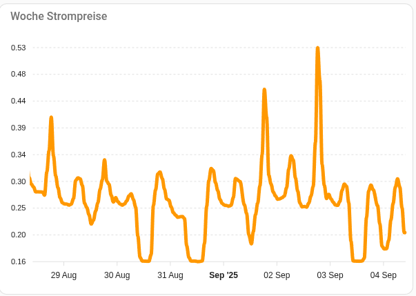
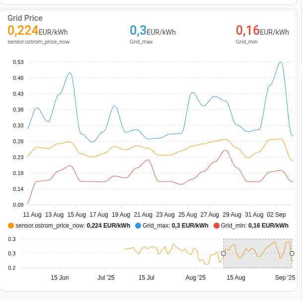

Forcast Preisanzeige und 12 Stunden in der Vergangenheit


```
type: custom:apexcharts-card
graph_span: 48h
span:
  start: hour
  offset: "-12h"
now:
  show: true
  label: Jetzt
all_series_config:
  unit: cent
header:
  show: true
  show_states: true
  colorize_states: true
  title: Preis Forecast
series:
  - entity: sensor.ostrom_raw_forcast_data_1 # muss eventuell angepasst werden
    data_generator: |
      return entity.attributes.data.map((start, index) => {
        return [new Date(start["date"]).getTime(), (entity.attributes.data[index]["price"])];
      });
    extend_to: false
    show:
      legend_value: false
      in_header: false
    name: ostrom_forecast
  - entity: sensor.ostrom_raw_forcast_data_1 # ev anpassen
    extend_to: now

```


Preisanzeige über einer Woche




```
type: custom:apexcharts-card
graph_span: 7d
header:
  show: true
  title: Woche Strompreise
  show_states: false
  colorize_states: true
series:
  - entity: sensor.ostrom_actual_price_1 # ev anpassen
    float_precision: 2
yaxis:
  - decimals: 2

```


Und Preise über ein Quartal Tagesgenau mit Min / Max / Durchschnitt



```
type: custom:apexcharts-card
experimental:
  brush: true
graph_span: 95d
all_series_config:
  stroke_width: 1
header:
  show: true
  title: Grid Price
  show_states: true
  colorize_states: true
series:
  - entity: sensor.ostrom_actual_price_1 # ev anpassen
    group_by:
      func: avg
      duration: 24h
    float_precision: 3
    show:
      in_brush: true
  - entity: sensor.ostrom_actual_price_1 # ev anpassen
    group_by:
      func: max
      duration: 24h
    name: Grid_max
    stroke_width: 1
    float_precision: 2
  - entity: sensor.ostrom_actual_price_1 # ev anpassen
    group_by:
      func: min
      duration: 24h
    name: Grid_min
    float_precision: 2
yaxis:
  - decimals: 2

```


